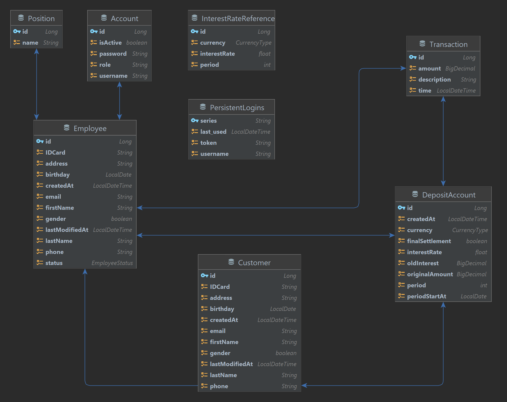

# Deposits Management Web Application

## Introduce
Deposit management system with functions:
+ Login employee
+ Manage customer information
+ Deposit
+ Final settlement
+ Partial withdrawal
+ Extra deposit

## How to run:
1. In file resources/application.properties:
   - config database info
   - change `spring.jpa.hibernate.ddl-auto=none` to `spring.jpa.hibernate.ddl-auto=update` in order to create database structure
2. Run command `mvn spring-boot:run` in terminal

## Demo
### [Deploy in Heroku](https://deposit-management.herokuapp.com) 
### [View Screenshot](https://github.com/Iamtinyfish/deposits-management/issues/7)

## Entity Diagram

